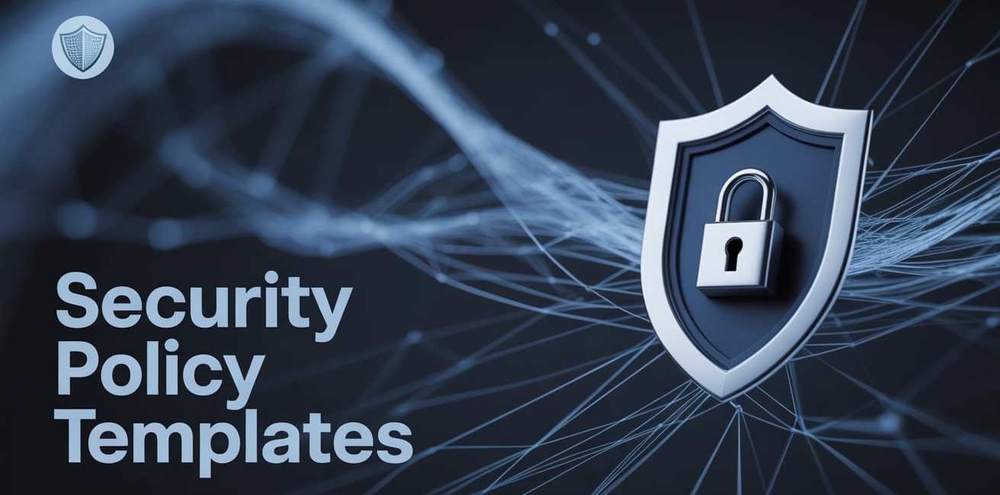
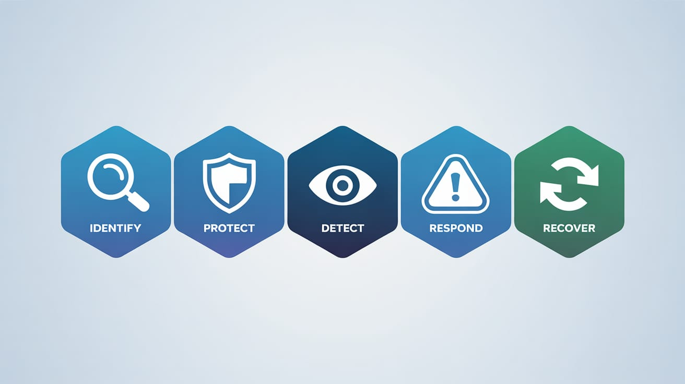
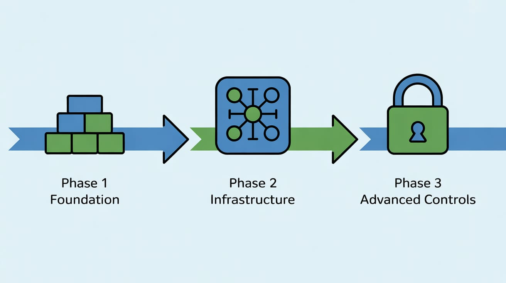
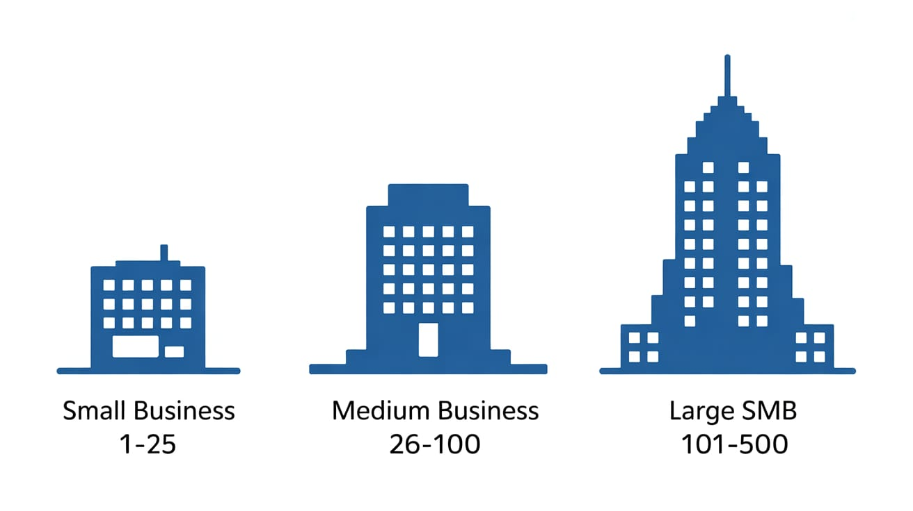

  

 

# Security Policy Templates

A comprehensive collection of NIST Cybersecurity Framework (CSF) aligned security policy templates designed specifically for small to medium businesses (SMBs). These ready-to-use templates provide a structured approach to implementing essential cybersecurity policies with practical implementation guidance.

## 🎯 Purpose

These policy templates help SMBs establish robust cybersecurity frameworks without the complexity typically associated with enterprise-grade security programs. Each policy is mapped to NIST CSF functions and includes practical implementation guidance tailored for resource-constrained environments.

## 📋 What's Included

### Core Security Policies
- **Acceptable Use Policy** - Guidelines for appropriate IT resource usage
- **Password Protection Policy** - Comprehensive password security requirements with MFA guidance
- **Clean Desk Policy** - Physical and digital workspace security controls
- **Email Policy** - Secure email practices and threat awareness

### Incident Response & Recovery
- **Data Breach Response Policy** - Step-by-step breach response procedures with notification requirements
- **Security Response Plan Policy** - Comprehensive incident management framework
- **Disaster Recovery Plan Policy** - Business continuity and system recovery procedures

### Infrastructure Security
- **Server Security Policy** - Comprehensive server hardening and protection guidelines
- **Router and Switch Security Policy** - Network infrastructure security requirements
- **Wireless Communication Policy** - Wireless network and device security controls

### Governance & Culture
- **Ethics Policy** - Information ethics and responsible technology use
- **Implementation Guidelines** - Detailed deployment roadmap with timelines and budgets

## 🚀 Quick Start

### 1. Assessment & Prioritization
Start with the **Implementation Guidelines** document to:
- Assess your current security posture
- Prioritize policies based on your risk profile
- Plan your implementation timeline

### 2. High Priority Policies (Weeks 1-4)
Begin with these foundational policies:
1. Password Protection Policy
2. Data Breach Response Policy  
3. Email Policy
4. Acceptable Use Policy

### 3. Customization
Replace all placeholders in the templates:
- `[Company Name]` - Your organization name
- `[Title/Role]` - Specific job titles or names
- `[Contact Info]` - Actual contact information
- `[Primary business application]` - Your critical systems

## 📊 NIST CSF Alignment

  

These policies comprehensively address all five NIST Cybersecurity Framework functions:

| Function | Coverage | Key Policies |
|----------|----------|--------------|
| **Identify (ID)** | Asset management, governance, risk assessment | Server Security, Ethics, Implementation Guidelines |
| **Protect (PR)** | Access control, awareness, data security | Password Protection, Clean Desk, Email, Acceptable Use |
| **Detect (DE)** | Continuous monitoring, anomaly detection | Security Response Plan, Infrastructure policies |
| **Respond (RS)** | Response planning, communications, analysis | Data Breach Response, Security Response Plan |
| **Recover (RC)** | Recovery planning, improvements | Disaster Recovery Plan, Security Response Plan |

## 💼 Implementation Approach

  

### Phase 1: Foundation (Weeks 1-4)
- Deploy basic security controls
- Establish incident response capability
- Implement user training programs

### Phase 2: Infrastructure (Weeks 5-8)
- Secure critical systems and networks
- Deploy comprehensive monitoring
- Test disaster recovery procedures

### Phase 3: Advanced Controls (Weeks 9-12)
- Complete policy framework
- Establish ongoing compliance monitoring
- Conduct security assessments

See **Implementation Guidelines** for detailed timelines, budgets, and success metrics.

## 🎯 Target Audience

  

### Small Businesses (1-25 employees)
- Essential security controls
- Simplified implementation approach
- Budget-conscious solutions

### Medium Businesses (26-100 employees)
- Comprehensive policy framework
- Scalable security architecture
- Compliance-ready documentation

### Larger SMBs (101-500 employees)
- Enterprise-grade security controls
- Advanced threat detection and response
- Regulatory compliance preparation

## 🛠️ Customization Guidance

### Technical Adaptations
- Adjust password complexity based on current capabilities
- Modify backup retention periods for business needs
- Scale response timeframes to match staffing levels
- Adapt encryption standards for compliance requirements

### Business Adaptations
- Customize recovery objectives (RTO/RPO)
- Modify incident severity classifications
- Update communication procedures
- Adjust training frequency and methods

### Industry-Specific Considerations
- **Healthcare**: Add HIPAA compliance requirements
- **Financial**: Include PCI DSS or SOX requirements  
- **Government Contractors**: Incorporate NIST 800-171 controls
- **International**: Address GDPR or regional data protection laws

## 📈 Expected Outcomes

### Short-term (3-6 months)
- Reduced security incident frequency
- Improved incident response capabilities
- Enhanced employee security awareness
- Basic compliance framework establishment

### Medium-term (6-12 months)
- Measurable risk reduction
- Faster incident detection and response
- Improved audit and compliance scores
- Cultural shift toward security awareness

### Long-term (12+ months)
- Comprehensive security posture
- Regulatory compliance achievement
- Business resilience improvement
- Competitive advantage through security

## 📚 Training Resources

### Executive Training
- Business risk and impact overview
- Policy framework and compliance requirements
- Resource allocation and budget planning

### IT Staff Training
- Technical implementation procedures
- Incident response and forensics
- System hardening and monitoring

### Employee Training
- Security awareness and best practices
- Policy compliance requirements
- Incident recognition and reporting

## 🔍 Compliance & Auditing

### Regular Assessment Schedule
- **Monthly**: Access control and basic compliance checks
- **Quarterly**: Comprehensive policy compliance reviews
- **Annually**: Full security posture assessments

### Key Metrics
- Policy compliance rates
- Incident response effectiveness
- Security awareness improvement
- Risk reduction measurements

## 🤝 Contributing

We welcome contributions to improve these policy templates:
- Submit issues for unclear guidance or missing elements
- Propose enhancements based on implementation experience
- Share industry-specific adaptations
- Provide feedback on implementation effectiveness

## 📄 License

This project is licensed under the Mozilla Public License 2.0 - see the LICENSE file for details.

## ⚠️ Important Notes

- These templates provide guidance but may require legal review for your jurisdiction
- Customize all policies to match your specific business environment
- Regular updates are essential as threats and regulations evolve
- Consider professional security consultation for complex environments

## 🆘 Support

- Review the Implementation Guidelines for detailed deployment guidance
- Check the Issues section for common implementation questions
- Consider professional cybersecurity consultation for complex requirements

---

**Start securing your business today with these practical, proven security policy templates.**
