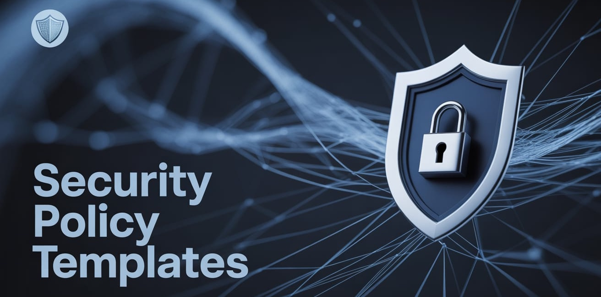
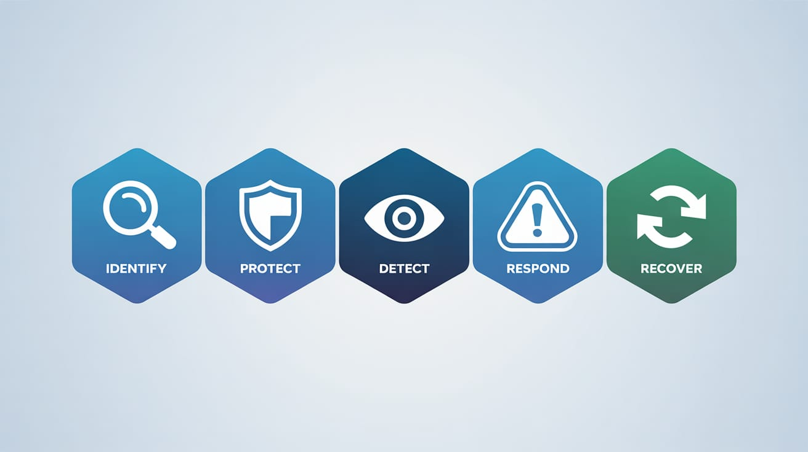
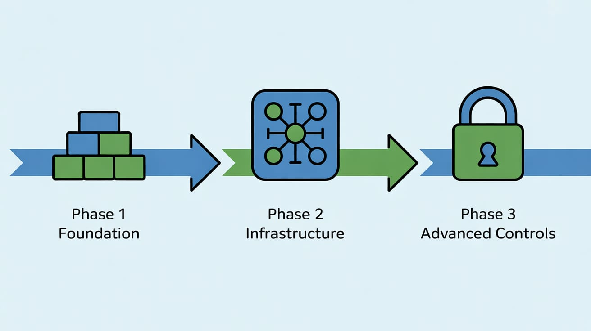
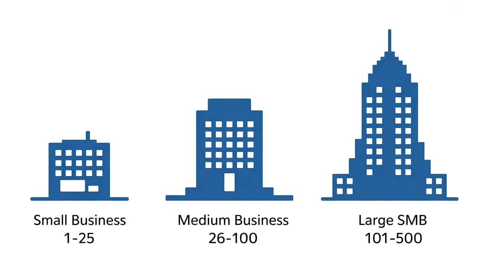

  

 

# Security Policy Templates

A comprehensive collection of NIST Cybersecurity Framework (CSF) aligned security policy templates designed specifically for small to medium businesses (SMBs). These ready-to-use templates provide a structured approach to implementing essential cybersecurity policies with practical implementation guidance.

## Purpose

These policy templates help SMBs establish robust cybersecurity frameworks without the complexity typically associated with enterprise-grade security programs. Each policy is mapped to NIST CSF functions and includes practical implementation guidance tailored for resource-constrained environments.

## What's Included

### Core Security Policies
- **Acceptable Use Policy** - Guidelines for appropriate IT resource usage
- **Password Protection Policy** - Comprehensive password security requirements with MFA guidance
- **Clean Desk Policy** - Physical and digital workspace security controls
- **Email Policy** - Secure email practices and threat awareness

### Incident Response & Recovery
- **Data Breach Response Policy** - Step-by-step breach response procedures with notification requirements
- **Security Response Plan Policy** - Comprehensive incident management framework
- **Disaster Recovery Plan Policy** - Business continuity and system recovery procedures

### Infrastructure Security
- **Server Security Policy** - Comprehensive server hardening and protection guidelines
- **Router and Switch Security Policy** - Network infrastructure security requirements
- **Wireless Communication Policy** - Wireless network and device security controls

### Governance & Culture
- **Ethics Policy** - Information ethics and responsible technology use
- **Implementation Guidelines** - Detailed deployment roadmap with timelines and budgets

## Quick Start

### 1. Assessment & Prioritization
Start with the **Implementation Guidelines** document to:
- Assess your current security posture
- Prioritize policies based on your risk profile
- Plan your implementation timeline

### 2. High Priority Policies (Weeks 1-4)
Begin with these foundational policies:
1. Password Protection Policy
2. Data Breach Response Policy
3. Email Policy
4. Acceptable Use Policy

### 3. Customization
Replace all placeholders in the templates:
- `[Company Name]` - Your organization name
- `[Title/Role]` - Specific job titles or names
- `[Contact Info]` - Actual contact information
- `[Primary business application]` - Your critical systems

## NIST CSF Alignment

  

These policies comprehensively address all five NIST Cybersecurity Framework functions:

| Function | Coverage | Key Policies |
|----------|----------|--------------|
| **Identify (ID)** | Asset management, governance, risk assessment | Server Security, Ethics, Implementation Guidelines |
| **Protect (PR)** | Access control, awareness, data security | Password Protection, Clean Desk, Email, Acceptable Use |
| **Detect (DE)** | Continuous monitoring, anomaly detection | Security Response Plan, Infrastructure policies |
| **Respond (RS)** | Response planning, communications, analysis | Data Breach Response, Security Response Plan |
| **Recover (RC)** | Recovery planning, improvements | Disaster Recovery Plan, Security Response Plan |

## Implementation Approach

  

### Phase 1: Foundation (Weeks 1-4)
- Deploy basic security controls
- Establish incident response capability
- Implement user training programs

### Phase 2: Infrastructure (Weeks 5-8)
- Secure critical systems and networks
- Deploy comprehensive monitoring
- Test disaster recovery procedures

### Phase 3: Advanced Controls (Weeks 9-12)
- Complete policy framework
- Establish ongoing compliance monitoring
- Conduct security assessments

See **Implementation Guidelines** for detailed timelines, budgets, and success metrics.

## Target Audience

  

### Small Businesses (1-25 employees)
- Essential security controls
- Simplified implementation approach
- Budget-conscious solutions

### Medium Businesses (26-100 employees)
- Comprehensive policy framework
- Scalable security architecture
- Compliance-ready documentation

### Larger SMBs (101-500 employees)
- Enterprise-grade security controls
- Advanced threat detection and response
- Regulatory compliance preparation

## Customization Guidance

### Technical Adaptations
- Adjust password complexity based on current capabilities
- Modify backup retention periods for business needs
- Scale response timeframes to match staffing levels
- Adapt encryption standards for compliance requirements

### Business Adaptations
- Customize recovery objectives (RTO/RPO)
- Modify incident severity classifications
- Update communication procedures
- Adjust training frequency and methods

### Industry-Specific Considerations
- **Healthcare**: Add HIPAA compliance requirements
- **Financial**: Include PCI DSS or SOX requirements
- **Government Contractors**: Incorporate NIST 800-171 controls
- **International**: Address GDPR or regional data protection laws

## Expected Outcomes

### Short-term (3-6 months)
- Reduced security incident frequency
- Improved incident response capabilities
- Enhanced employee security awareness
- Basic compliance framework establishment

### Medium-term (6-12 months)
- Measurable risk reduction
- Faster incident detection and response
- Improved audit and compliance scores
- Cultural shift toward security awareness

### Long-term (12+ months)
- Comprehensive security posture
- Regulatory compliance achievement
- Business resilience improvement
- Competitive advantage through security

## Training Resources

### Executive Training
- Business risk and impact overview
- Policy framework and compliance requirements
- Resource allocation and budget planning

### IT Staff Training
- Technical implementation procedures
- Incident response and forensics
- System hardening and monitoring

### Employee Training
- Security awareness and best practices
- Policy compliance requirements
- Incident recognition and reporting

## Compliance & Auditing

### Regular Assessment Schedule
- **Monthly**: Access control and basic compliance checks
- **Quarterly**: Comprehensive policy compliance reviews
- **Annually**: Full security posture assessments

### Key Metrics
- Policy compliance rates
- Incident response effectiveness
- Security awareness improvement
- Risk reduction measurements

---

## Mapped to Enterprise Frameworks

These policy templates are pre-mapped to the major compliance frameworks used in enterprise procurement and regulatory audits. Full control-level mappings are in the [`/mappings`](./mappings/) directory.

| Policy | ISO 27001:2022 | NIST CSF | SOC 2 | LGPD | BACEN 4893 |
|--------|---------------|----------|-------|------|------------|
| [Acceptable Use](policies/01-governance/acceptable_use_policy.md) | 5.1, 5.10 | ID.AM, PR.AT | CC1.1, CC6.1 | Art. 46 | Art. 4 |
| [Password Protection](policies/02-access-control/password_protection_policy.md) | 5.15–5.18, 8.5 | PR.AC | CC6.1, CC6.3 | Art. 46 | Art. 4 |
| [Clean Desk](policies/02-access-control/clean_desk_policy.md) | 7.7 | PR.AC | CC6.4 | Art. 46 | — |
| [Email](policies/03-communications/email_policy.md) | 5.14, 8.23 | PR.AT, DE.AE | CC2.2, CC7.2 | Art. 46 | Art. 4 |
| [Data Classification](policies/01-governance/data_classification_policy.md) | 5.9, 5.12 | ID.AM, PR.DS | C1.1, CC3.2 | Art. 6, 46 | Art. 4 |
| [Data Breach Response](policies/04-incident-response/data_breach_response_policy.md) | 5.24–5.26 | RS.CO, RS.AN | CC7.3, CC7.4 | Art. 48 | Art. 12–13 |
| [Security Response Plan](policies/04-incident-response/security_response_plan_policy.md) | 5.24–5.26 | RS, DE | CC7.3, CC7.4, CC7.5 | Art. 48 | Art. 12–13 |
| [Disaster Recovery](policies/06-continuity/disaster_recovery_plan_policy.md) | 5.30, 8.13 | RC.RP | A1.2, A1.3 | Art. 46 | Art. 6 |
| [Server Security](policies/05-infrastructure/server_security_policy.md) | 8.8, 8.9, 8.15 | PR.IP, DE.CM | CC7.1, CC7.2 | Art. 46 | Art. 4 |
| [Cloud Security](policies/05-infrastructure/cloud_security_policy.md) | 5.19, 5.23, 8.25 | PR.IP, ID.AM | CC6.6, CC7.2 | Art. 46 | Art. 4, 5 |
| [Vulnerability Management](policies/05-infrastructure/vulnerability_patch_management_policy.md) | 8.8 | PR.IP, ID.RA | CC7.1 | Art. 46 | Art. 5, 6 |
| [Vendor / Third-Party Risk](policies/01-governance/vendor_third_party_risk_policy.md) | 5.19–5.22 | ID.SC | CC9.2 | Art. 46, 50 | Art. 7, 14 |
| [Change Management](policies/01-governance/change_management_policy.md) | 8.32 | PR.IP | CC8.1 | Art. 46 | Art. 5 |
| [Remote Work / BYOD](policies/02-access-control/remote_work_byod_policy.md) | 6.7, 8.1 | PR.AC, PR.IP | CC6.6, CC6.7 | Art. 46 | Art. 4 |
| [AI Usage Governance](policies/01-governance/ai_usage_governance_policy.md) | 5.1, 5.10, 5.12 | ID.GV, PR.DS | CC1.1, CC3.2 | Art. 6, 46 | Art. 4 |

> **Full clause-level mappings** → [`/mappings`](./mappings/) directory
>
> **Note on BACEN article numbers:** The 72-hour incident-notification clock under BACEN Res. 4.893/2021 lives in Articles 12 and 13, not Article 11. The data-breach and security-response rows above were corrected on 2026-05-18.

---

## LatAm Compliance

Operating in Brazil, Mexico, or Argentina? See the companion repository for jurisdiction-specific compliance mappings:

**[HailBytes LatAm Compliance Mappings](https://github.com/HailBytes/latam-compliance-mappings)** — How HailBytes SAT and ASM map to LGPD, BACEN 4.893, LFPDPPP, and more. Includes PT-BR document templates (DPA, Incident Response Runbook, Vendor Risk Assessment).

---

## Need Help Operationalizing These Policies?

Templates are a starting point. Enterprise buyers — and the auditors behind them — require evidence of *implementation*, not just documentation.

**HailBytes ships these policies pre-mapped to our Security Awareness Training (SAT) and Attack Surface Management (ASM) platforms**, with a SOC 2 roadmap and enterprise trust package available on request. This stack is purpose-built for organizations moving from SMB-grade policy documents to enterprise-ready compliance attestation.

- Policies pre-integrated with NIST CSF and SOC 2 control dashboards
- Continuous control monitoring via Attack Surface Management
- Staff training modules tied directly to each policy (with completion tracking)
- SOC 2 Type II readiness roadmap included for qualifying accounts
- LGPD and BACEN 4893 alignment for Brazil-market enterprise deals

> **Ready to move from templates to attestation?**  
> [Request an enterprise trust package →](https://hailbytes.com/enterprise?utm_source=github&utm_medium=readme&utm_campaign=enterprise-trust)  
> [Book a 30-minute compliance scoping call →](https://hailbytes.com/contact?utm_source=github&utm_medium=readme&utm_campaign=enterprise-trust)

---

## Free: Enterprise Compliance Roadmap

**From SMB policies → SOC 2 → enterprise readiness.** One-page PDF covering the milestones, common gaps, and what enterprise procurement teams actually check before signing.

Includes:
- The 4 gaps that kill enterprise deals before security review even starts
- How to sequence SOC 2 Type II prep without a full-time GRC hire
- What financial institutions, healthcare networks, and government contractors ask for in vendor security reviews
- How to map these templates to a defensible audit evidence package in 90 days

> [Download the Enterprise Compliance Roadmap — free, email required →](https://hailbytes.com/compliance-roadmap?utm_source=github&utm_medium=readme&utm_campaign=enterprise-trust)

---

## Contributing

We welcome contributions to improve these policy templates:
- Submit issues for unclear guidance or missing elements
- Propose enhancements based on implementation experience
- Share industry-specific adaptations
- Provide feedback on implementation effectiveness

## License

This project is licensed under the Mozilla Public License 2.0 - see the LICENSE file for details.

## Important Notes

- These templates provide guidance but may require legal review for your jurisdiction
- Customize all policies to match your specific business environment
- Regular updates are essential as threats and regulations evolve
- Consider professional security consultation for complex environments

## Support

- Review the Implementation Guidelines for detailed deployment guidance
- Check the Issues section for common implementation questions
- Consider professional cybersecurity consultation for complex requirements

---

**Start securing your business today with these practical, proven security policy templates.**

---

### Enterprise Security & Compliance — Powered by HailBytes

**These templates are the foundation. HailBytes is the partner who operationalizes them.**

Trusted by enterprise security teams for Security Awareness Training (SAT), Attack Surface Management (ASM), and end-to-end compliance program delivery — including SOC 2 attestation, ISO 27001 readiness, and LGPD / BACEN alignment for Brazil-market deals.

[SOC 2 Readiness](https://hailbytes.com/enterprise?utm_source=github&utm_medium=readme&utm_campaign=enterprise-trust-banner) · [ISO 27001](https://hailbytes.com/enterprise?utm_source=github&utm_medium=readme&utm_campaign=enterprise-trust-banner) · [LGPD / BACEN Compliance](https://hailbytes.com/enterprise?utm_source=github&utm_medium=readme&utm_campaign=enterprise-trust-banner) · [Enterprise Trust Package](https://hailbytes.com/enterprise?utm_source=github&utm_medium=readme&utm_campaign=enterprise-trust-banner)

